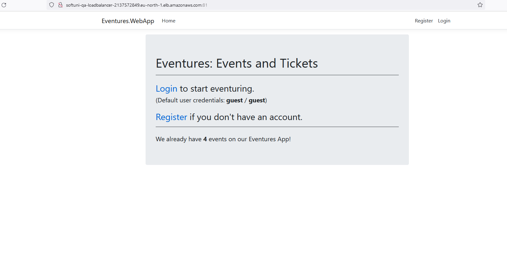

# Eventures-Web-App-Manual-Testing
Workshop: Manual Testing

 

This repo contains developed test cases based on functional and technical specifications also executed them manually to verify software functionality
You are given a MVC web app. To run the app, go to:

http://softuni-qa-loadbalancer-2137572849.eu-north-1.elb.amazonaws.com:81/

The Web app holds a list of events with the ability for a user to register and login.

